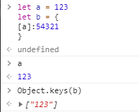

# JS对象-饥人谷

## 对象的定义 
* 无序的数据集合
* 键值对的集合(*键名是字符串，空字符串也是字符串*))
* 键名只能是字符串，不是标识符，可以包含任何字符
* 引号可以省略，但是省略之后，只能按照标识符的要求设置键名
* 就算引号省略了，键名还是标识符
* 如果想要将变量作为键名，那么应该用[]将该键名括起，例：
 

-------------

### 对象的隐藏属性
* JS中每一个对象都有一个隐藏属性
* 这个隐藏属性储存着其共有属性组成的对象的地址
* 这个共有属性组成的对象叫原型，即隐藏属性储存着原型的地址

## 对象的声明
对象的声明一般包含两种方式： 
1. ```javascript
    let obj = {
        'name':'7ty','age':18
    }
    ```
2. ```javascript
    let obj = new Object({'name':'7ty'})
    ```
这两种声明方法中，第二种为正规声明方法。   


### 判断对象是否含有某属性
一般来说，我们可以使用
```javascript
'name' in obj
```
和
```javascript
obj.hasOwnProperty('name')
```
来判断obj对象中是否含有name属性，但两者的区别在于：obj.hasOwnProperty('name')仅在name为obj的自身属性时才返回true，而in在name为obj的共有属性的情况下也可返回true。

------------

## 对象的增删改查

### 删
* delete obj.xxx 或者delet obj['xxx']，即可删除obj的xxx属性

* **判断某一属性名是否存在于对象中的方法：**'xxx' in obj,返回true为存在，false为不存在。该属性可以是共有的，也可以是自身的。

### 查
* **查看自身所有属性：** object.keys(obj)
* **查看自身+共有属性：** console.dir(obj)
* **判断一个属性是自身的还是共有的：** obj.hasOwnProperty('toString')

### 增 改
#### 修改属性值
* **直接赋值**
* **批量赋值：** Object.assign,(obj,{age:18,gender:'man'}) 
* 无法通过自身修改或增加共有属性

#### 修改隐藏属性
ES6给了一种方法：使用Object.create

